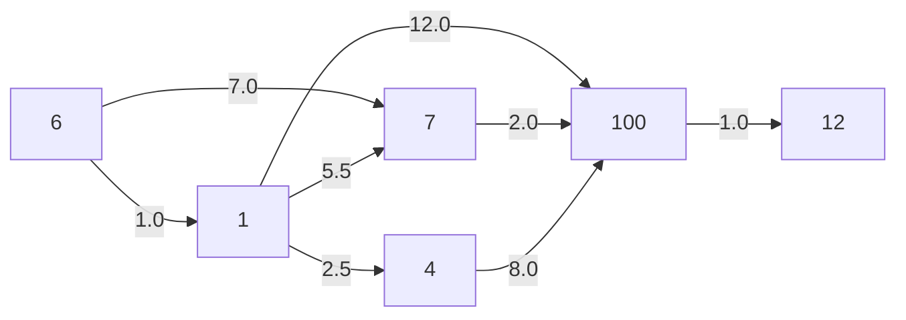

# Графы в ЕГЭ по информатике: пути во взвешенном DAG

Памятка по задачам вида «В текстовом файле содержится описание **ациклического ориентированного взвешенного графа**…» (серия Л. Шастина на kompege).

> [!TIP]
> Как пользоваться: найди в таблице ниже фразу из условия и перейди к рецепту. Во всех рецептах используется **одна и та же шапка** и **один и тот же движок**, меняются только последние 2–3 строки.

---

## Навигатор: фраза в условии → рецепт

| Если в условии написано… | Рецепт |
|---|---|
| «длина **кратчайшего** пути из S в T» | [A](#a-кратчайший-путь-s--t) |
| «**максимальная** длина пути из S в T» | [B](#b-самый-длинный-путь-s--t) |
| «путь **проходит через** вершину X» | [C](#c-путь-через-обязательную-вершину-x) |
| «**первое ребро** ведёт из … в …, **последнее** из … в …» | [D](#d-заданы-первое-и-последнее-ребро) |
| «до какого-либо из **тупиков**» (из вершины не выходит рёбер) | [E](#e-путь-до-тупиков) |
| «из какого-либо **истока**» (в вершину не входит рёбер) | [F](#f-путь-из-истоков) |
| «**из любой** вершины графа в T» | [G](#g-из-любой-вершины-в-t) |
| «самый длинный путь **в графе**» (старт и конец не заданы) | [H](#h-самый-длинный-путь-во-всём-графе) |
| «наименьшее / наибольшее **количество рёбер**» | [I](#i-считаем-рёбра-а-не-веса) |
| «**сколько** существует путей / различных путей» | [J](#j-количество-путей) |
| «**не проходит** через вершину X / ребро X→Y» | [K](#k-запрещённая-вершина-или-ребро) |
| «сколько вершин / тупиков **достижимо**» | [L](#l-достижимость) |

---

## Словарик

| Слово | Что значит | Как найти в коде |
|---|---|---|
| **Ребро** a→b | стрелка, по которой можно пройти только из `a` в `b` | строка файла `a b w` |
| **Вес** w | «цена» ребра | третье число строки, **дробное** |
| **Длина пути** | сумма весов рёбер пути | то, что лежит в `d[v]` |
| **Ациклический** | ушёл из вершины и больше в неё не вернёшься | ничего делать не надо, это просто гарантирует, что код не зациклится |
| **Тупик** (сток) | из вершины **не выходит** рёбер | `v not in starts` |
| **Исток** | в вершину **не входит** рёбер | `v not in ends` |

Пример из условия (ответ 9):



---

## 0. Шапка: чтение файла (копируется всегда)

```python
edges = []
for line in open('23.txt'):
    if not line.strip():                 # пропускаем пустые строки
        continue
    a, b, w = line.split()               # split() без аргументов съедает любые пробелы и табы
    edges.append((int(a), int(b), float(w)))   # вес ДРОБНЫЙ, поэтому float

starts = {a for a, b, w in edges}        # вершины, из которых ЧТО-ТО выходит
ends   = {b for a, b, w in edges}        # вершины, в которые ЧТО-ТО входит
verts  = starts | ends                   # все вершины
W = {(a, b): w for a, b, w in edges}     # вес ребра по паре: W[a, b]
```

## 1. Движок: релаксация (копируется всегда)

```python
def relax(edges, sources, mode='min'):
    """d[v] = лучшая (min или max) длина пути от любой из sources до v.
    Вершин, до которых дойти нельзя, в d НЕТ."""
    d = {s: 0 for s in sources}
    changed = True
    while changed:                       # крутим, пока что-то улучшается
        changed = False
        for a, b, w in edges:
            if a in d:                   # из a идём, только если до неё уже дошли
                nd = d[a] + w
                if b not in d or (nd < d[b] if mode == 'min' else nd > d[b]):
                    d[b] = nd
                    changed = True
    return d
```

Логика в одну строку: для каждого ребра a→b спрашиваем, не станет ли путь до `b` через `a` лучше известного. Если станет, обновляем. Повторяем, пока за целый проход ничего не изменилось.

| Нужно | Вызов |
|---|---|
| кратчайшие пути от S | `relax(edges, [S])` |
| самые длинные пути от S | `relax(edges, [S], 'max')` |
| от нескольких стартов сразу | `relax(edges, [S1, S2, ...])` |

---

## Рецепты

### A. Кратчайший путь S → T

```python
d = relax(edges, [S])
print(int(d[T]))
```

### B. Самый длинный путь S → T

```python
d = relax(edges, [S], 'max')
print(int(d[T]))
```

### C. Путь через обязательную вершину X

Разрезаем путь на два куска: S→X и X→T.

```python
print(int(relax(edges, [S])[X] + relax(edges, [X])[T]))       # кратчайший
print(int(relax(edges, [S], 'max')[X] + relax(edges, [X], 'max')[T]))  # длиннейший
```

Если обязательных вершин несколько (X, потом Y), кусков будет три: S→X, X→Y, Y→T.

### D. Заданы первое и последнее ребро

Условие: первое ребро S→P, последнее Q→T. Середину P→Q считаем движком, крайние рёбра берём из словаря.

```python
print(int(W[S, P] + relax(edges, [P])[Q] + W[Q, T]))    # задача 31673 → 285
```

### E. Путь до тупиков

```python
d = relax(edges, [S], 'max')            # 'min', если просят минимальный
print(int(max(d[v] for v in d if v not in starts)))    # min(...) для минимального
```

`for v in d` перебирает только **достижимые** вершины, `v not in starts` оставляет из них тупики.

> [!WARNING]
> Если S сама является тупиком, то в `d` лежит `{S: 0}`, и ответ получится 0. Обычно условие гарантирует, что такого не будет.

### F. Путь из истоков

Стартуем сразу из всех истоков, передав их списком.

```python
sources = [v for v in verts if v not in ends]
d = relax(edges, sources, 'max')
print(int(d[T]))
```

### G. Из любой вершины в T

Разворачиваем все стрелки и ищем пути **от** T.

```python
rev = [(b, a, w) for a, b, w in edges]
d = relax(rev, [T], 'max')
print(int(max(d.values())))
```

### H. Самый длинный путь во всём графе

Стартуем из всех вершин сразу.

```python
d = relax(edges, verts, 'max')
print(int(max(d.values())))
```

Стартовать можно только из истоков, результат будет тем же: самый длинный путь всегда начинается в истоке.

### I. Считаем рёбра, а не веса

Ставим всем рёбрам вес 1, дальше работает любой рецепт выше.

```python
e1 = [(a, b, 1) for a, b, w in edges]
print(relax(e1, [S])[T])                # минимум рёбер от S до T
print(relax(e1, [S], 'max')[T])         # максимум рёбер
```

### J. Количество путей

Релаксация здесь **не подходит**, нужна рекурсия с памятью: число путей из v в T равно сумме чисел путей из всех вершин, куда из v ведёт ребро.

```python
import sys
from functools import lru_cache
from collections import defaultdict
sys.setrecursionlimit(100000)

out = defaultdict(list)
for a, b, w in edges:
    out[a].append(b)

@lru_cache(None)
def cnt(v):
    if v == T:
        return 1
    return sum(cnt(u) for u in out[v])

print(cnt(S))
```

Путей бывает астрономически много, но Python хранит большие числа без переполнения.

### K. Запрещённая вершина или ребро

Выкидываем лишнее из списка рёбер и дальше решаем как обычно.

```python
e2 = [(a, b, w) for a, b, w in edges if a != X and b != X]    # без вершины X
e3 = [(a, b, w) for a, b, w in edges if (a, b) != (X, Y)]     # без ребра X→Y
print(int(relax(e2, [S])[T]))
```

### L. Достижимость

```python
d = relax(edges, [S])
print(len(d) - 1)                                  # сколько вершин достижимо (без самой S)
print(sum(1 for v in d if v not in starts))        # сколько тупиков достижимо
```

---

## Чек-лист перед сдачей

- [ ] **`float(w)`**, а не `int(w)`: веса дробные, и `int('57.66')` падает с ошибкой.
- [ ] **`int(...)`**, а не `round(...)`: просят **целую часть**.
- [ ] **`split()`**, а не `split(' ')`: в файле бывают табы и двойные пробелы.
- [ ] **min или max?** Перечитай, какое слово стоит в условии: «кратчайший» или «максимальная».
- [ ] **Все условия учтены?** Если проигнорировать заданные первое и последнее ребро в 31673, получится 229 вместо 285.
- [ ] **`starts` и `ends` строятся после цикла чтения**, а не внутри него. Иначе программа будет пересобирать множество на каждой строке и зависнет.
- [ ] **`KeyError` на `d[T]`** значит, что T недостижима из S. Проверь номера вершин в условии.
- [ ] **Прогони на примере из условия** (там всегда есть ответ), и только потом запускай на большом файле.

## Если релаксация тормозит

Обычно она укладывается в секунды: на 85 000 рёбрах вышло 18 проходов и 0.5 с. Если вдруг ждать долго, для кратчайшего пути подойдёт Дейкстра (веса положительные, поэтому она работает):

```python
import heapq
from collections import defaultdict
out = defaultdict(list)
for a, b, w in edges:
    out[a].append((b, w))

d = {S: 0}
pq = [(0, S)]
while pq:
    dist, v = heapq.heappop(pq)
    if dist > d[v]:
        continue
    for u, w in out[v]:
        if dist + w < d.get(u, float('inf')):
            d[u] = dist + w
            heapq.heappush(pq, (d[u], u))
print(int(d[T]))
```

> [!CAUTION]
> Дейкстра **не** ищет самый длинный путь. Для max оставайся на релаксации.
